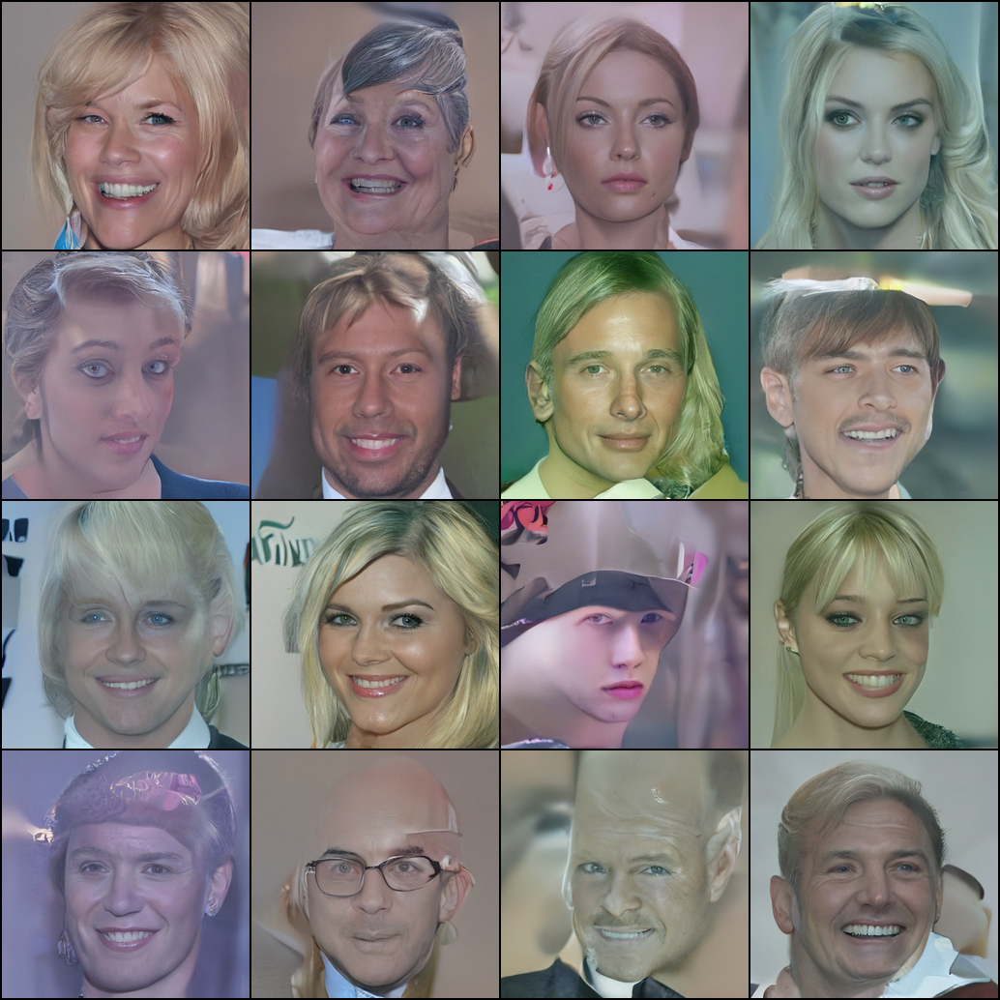
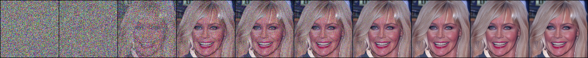
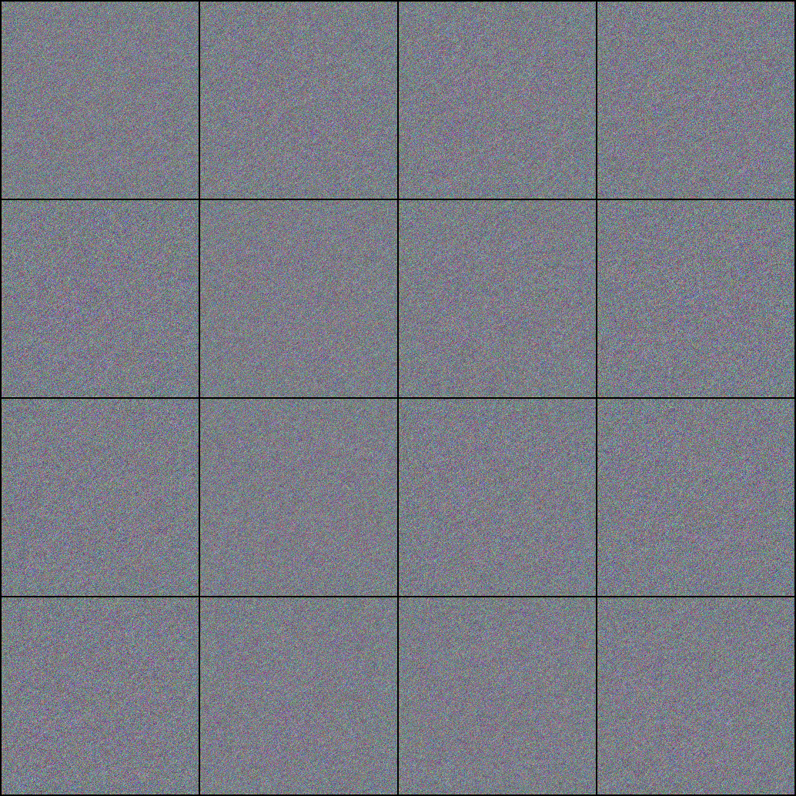
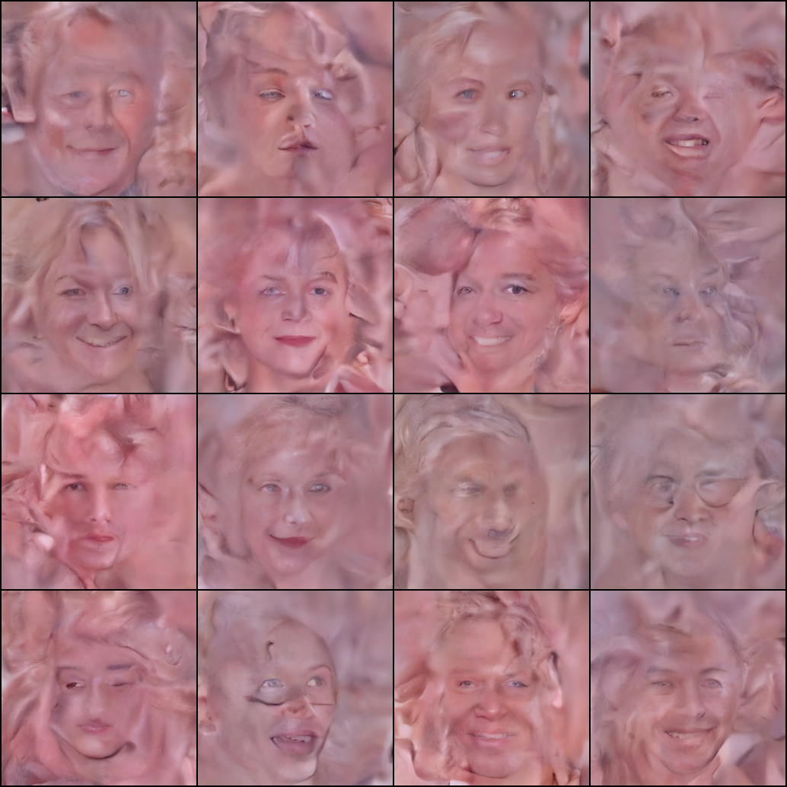
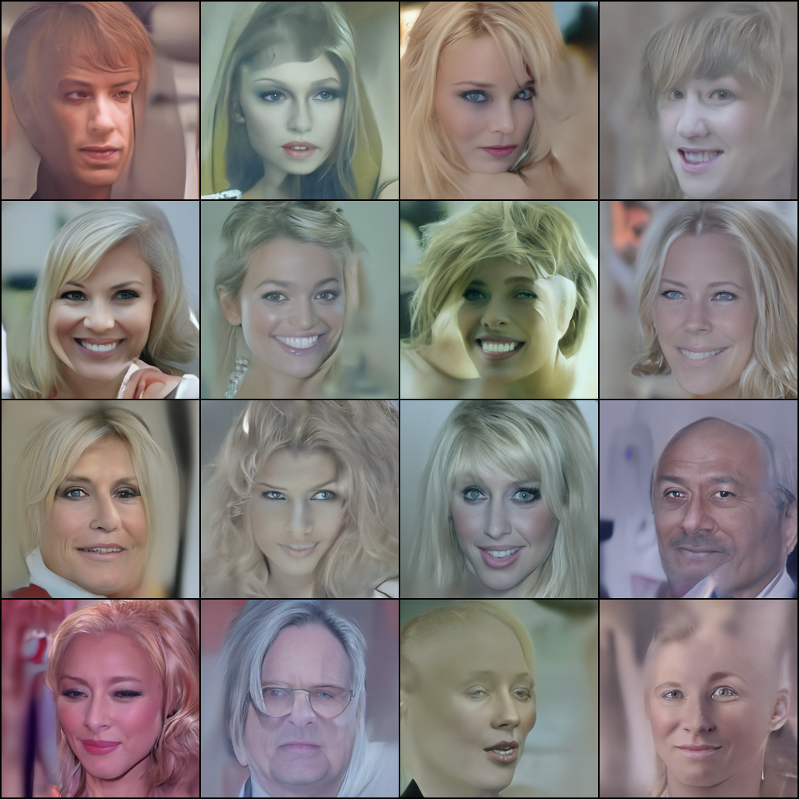
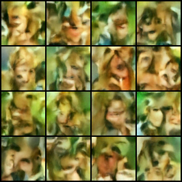
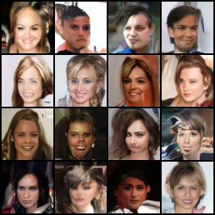

[](https://www.python.org/)
[](LICENSE)


# DDPM: Denoising Diffusion Probabilistic Model

A PyTorch implementation of Denoising Diffusion Probabilistic Models (DDPM) for high-quality image generation. This project implements the diffusion model architecture described in the paper "Denoising Diffusion Probabilistic Models" (Ho et al., 2020) and includes support for both DDPM and DDIM sampling strategies.

## 📋 Table of Contents

- [Features](#features)
- [Project Structure](#project-structure)
- [Main Results](#results)
- [Installation](#installation)
- [Usage](#usage)
- [Architecture](#architecture)
- [Docker Support](#docker-support)
- [Citation](#citation)

##  Features

- **DDPM Implementation**: Full implementation of the Denoising Diffusion Probabilistic Model
- **DDIM Support**: Fast deterministic sampling with Denoising Diffusion Implicit Models
- **U-Net Architecture**: Custom U-Net backbone with attention mechanisms for high-resolution image generation
- **Flexible Training**: Support for multiple training configurations including:
  - Exponential Moving Average (EMA) for stable training
  - Mixed precision training with automatic mixed precision
  - Gradient accumulation for large batch training
  - Learning rate warmup and scheduling
- **CelebA Dataset**: Built-in support for CelebA dataset with automatic download and preprocessing
- **Checkpoint Management**: Comprehensive checkpoint saving and resuming capabilities
- **Visualization Tools**: Utilities for generating sample grids and denoising strips

## Project Structure

```
.
├── src/
│   ├── model/
│   │   ├── difussion_class.py      # Main Diffusion class with DDPM/DDIM logic
│   │   ├── difussion_utils.py       # Beta schedules and utility functions
│   │   ├── unet_backbone.py         # U-Net denoiser architecture
│   │   └── attention.py             # Multi-head attention blocks
│   ├── data/
│   │   ├── load_data_from_torch.py  # CelebA data loading utilities
│   │   ├── load_data_local.py       # Local image dataset loader
│   │   └── subset_celebra.py        # Dataset subset utilities
│   ├── training_loops/
│   │   ├── main_train_loop.py       # Main training loop
│   │   ├── train_one_epoch.py       # Single epoch training
│   │   ├── ema.py                   # Exponential Moving Average
│   │   ├── chekpoints.py            # Checkpoint save/load utilities
│   │   ├── grad_scaler.py           # Gradient scaler for mixed precision
│   │   └── training_utils.py        # Training helper functions
│   └── testing/
│       ├── ddpm_inference.py         # DDPM sampling functions
│       └── ddpim_inference.py        # DDIM sampling functions
├── models/                           # Trained model checkpoints
├── Samples_low_gpu/                  # Generated samples from low-GPU training
├── Samples_attn_net/                 # Generated samples with attention network
├── Inference Samples_low_gpu/        # Post training DDPM and DDIM samples
└── notebooks_showcase/               # Jupyter notebooks for demonstration
```


## Main Results <a id="results"></a>


<p align="center">
  <b style="font-size:18px;">CelebA256 — Best Samples (65e)</b>
</p>

<p align="center">
  <!-- Clickable thumbnails: al hacer clic se ven en grande -->
  <a href="./inference_256celeba/DDPM/DDPM_65 epochs_grid.png">
    
  </a>
  &nbsp;&nbsp;
  <a href="./inference_256celeba/DDIM/celeba256_ddim_inference3.png">
    
  </a>
</p>

<p align="center">
  <sub><b>Izq:</b> DDPM (65e)&nbsp;&nbsp;•&nbsp;&nbsp;<b>Der:</b> DDIM (100 steps, 65e)</sub>
</p>

<br>

<!-- Strip de DDPM destacado arriba -->
<p align="center">
  <b>Denoising strip CelebHQ — DDPM (T → 0)</b><br>
  <sub>(999, 600, 300, 200, 100, 80, 40, 10, 5, 0)</sub>
</p>

<p align="center">
  <a href="./inference_256celeba/DDPM/celeba256_denoise_strip3.png">
    
  </a>
</p>

<br>

<!-- ===== Low GPU ===== -->
<p align="center">
  <b style="font-size:18px;">Low GPU — Best Samples (50e)</b>
</p>

<p align="center">
  <a href="./inference samples_low_gpu/50 epochs/DDPM/celeba64_samples_e3.png">
    
  </a>
  &nbsp;&nbsp;
  <a href="./inference samples_low_gpu/50 epochs/DDIM/celeba64_ddim50_2.png">
    
  </a>
</p>

<p align="center">
  <sub><b>Izq:</b> DDPM (50e)&nbsp;&nbsp;•&nbsp;&nbsp;<b>Der:</b> DDIM (50 steps, 50e)</sub>
</p>

<p align="center">
  <b>Denoising strip Celeb64x64 — DDPM (T → 0)</b><br>
  <sub>(999, 600, 300, 200, 100, 80, 40, 10, 5, 0)</sub>
</p>

<p align="center">
  <a href="./inference_256celeba/DDPM/celeba256_denoise_strip3.png">
    
  </a>
</p>


<hr>

## 🔁 Training Progress

### CelebA256 (quick glance)

<p align="center">
  <b style="margin-right:140px;">Epoch 0</b>
  <b style="margin-right:140px;">Epoch 27</b>
  <b>Epoch 60</b><br><br>

  <a href="./samples_256celeba/celeba256_ddpm_attn_samples_e000.png">
    
  </a>
  <a href="./samples_256celeba/celeba256_ddpm_attn_samples_e028.png">
    
  </a>
  <a href="./samples_256celeba/celeba256_ddpm_attn_samples_e060.png">
    
  </a>
</p>

<br>

### Low GPU (quick glance)

<p align="center">
  <b style="margin-right:140px;">Epoch 0</b>
  <b style="margin-right:140px;">Epoch 20</b>
  <b>Epoch 40</b><br><br>

  <a href="./samples_low_gpu/celeba64_ddpm_lowgpu_samples_e000.png">
    
  </a>
  <a href="./samples_low_gpu/celeba64_ddpm_lowgpu_samples_e014.png">
    
  </a>
  <a href="./samples_low_gpu/celeba64_ddpm_lowgpu_samples_e054.png">
    
  </a>
</p>

<hr>

## 🔬 Inference — Detailed Comparisons

<details>
<summary><b>CelebA256 — More Analisis</b></summary>

<br>

**DDIM comparison in diferent Epochs**

| DDIM 50 steps (45e) | DDIM 50 steps (55e) |
|---|---|
|  |  |

**Denoising strips**
- *DDPM — 1000 epochs — T → 0* (999,600,300,200,100,80,40,10,5,0):  
  


</details>

<br>

<details>
<summary><b>Low GPU — More Analisi</b></summary>

<br>

Inference — DDPM (30 vs 50 epochs)


| DDPM — 30 epochs | DDPM — 50 epochs |
|---|---|
|  |  |


Inference — DDPM vs DDIM (50 epochs)

| DDPM (50e) | DDIM 50 steps (50e) |
|---|---|
|  |  |

**Denoising strips**

*DDPM — 1000 epochs — denoising de T → 0* (Showing 999,600,300,200,100,80,40,10,5,0 T) :

  

*DDIM — 50 steps — denoising de T → 0*:


</details>

<hr>


## Installation

### Prerequisites

- Python 3.8+
- CUDA-capable GPU (recommended) or CPU
- PyTorch 1.12+ with CUDA support (optional, for GPU acceleration)

### Setup

1. Clone the repository:

```bash
git clone <repository-url>
cd "Difussion Model"
```

2. Install dependencies:

```bash
pip install -r requirements.txt
```

### Docker Installation

Alternatively, you can use Docker to run the project in a containerized environment:

```bash
# Build the Docker image
docker build -t ddpm-model .

# Run the container
docker run --gpus all -it ddpm-model
```

## Usage

### Training

Train a DDPM model on the CelebA dataset:

```python
import torch
from src.model.difussion_class import Diffusion
from src.model.unet_backbone import build_unet_64x64
from src.data.load_data_from_torch import get_celeba_loaders
from src.training_loops.main_train_loop import train_ddpm
from src.training_loops.ema import ExponentialMovingAverage
from src.training_loops.chekpoints import make_checkpoint_utils

# Setup
device = "cuda" if torch.cuda.is_available() else "cpu"
img_size = 64
batch_size = 128

# Load data
train_loader, val_loader, test_loader = get_celeba_loaders(
    root="./data",
    img_size=img_size,
    batch_size=batch_size
)

# Initialize model and diffusion
model = build_unet_64x64(
    in_channels=3,
    base_channels=128,
    channel_mults=(1, 2, 2, 2),
    num_res_blocks=2,
    attn_resolutions={16, 8},
    dropout=0.1
).to(device)

diffusion = Diffusion(
    T=1000,
    schedule="linear",
    beta_min=1e-4,
    beta_max=2e-2,
    img_size=img_size
).to(device)

# Setup optimizer and EMA
optimizer = torch.optim.AdamW(model.parameters(), lr=2e-4, weight_decay=1e-6)
ema = ExponentialMovingAverage(model.parameters(), decay=0.9999)

# Training
save_ckpt, load_ckpt = make_checkpoint_utils()
train_ddpm(
    model=model,
    diffusion=diffusion,
    train_loader=train_loader,
    optimizer=optimizer,
    ema=ema,
    device=device,
    epochs=50,
    base_lr=2e-4,
    warmup_steps=1000,
    sample_every=5,
    sample_n=36,
    img_size=img_size,
    ckpt_dir="checkpoints",
    run_name="ddpm_celeba64",
    ckpt_utils=(save_ckpt, load_ckpt)
)
```

### Inference

Generate samples using a trained model:

```python
from src.testing.ddpm_inference import ddpm_infer_sample

# Load checkpoint
checkpoint = torch.load("models/celeba64_ddpm_lowgpu_55.pt")
model.load_state_dict(checkpoint["model"])

# Generate samples
ddpm_infer_sample(
    model=model,
    diffusion=diffusion,
    n=36,
    img_size=64,
    device=device,
    out_path="samples.png"
)
```

### DDIM Sampling

For faster, deterministic sampling:

```python
from src.testing.ddpim_inference import ddim_infer_sample

ddim_infer_sample(
    model=model,
    diffusion=diffusion,
    n=36,
    img_size=64,
    steps=50,
    eta=0.0,
    device=device,
    out_path="samples_ddim.png"
)
```


## Architecture

### Diffusion Process

The model implements the forward and reverse diffusion processes:

- **Forward Process**: Gradually adds Gaussian noise to images over T timesteps
- **Reverse Process**: Learns to denoise images step by step to generate new samples

### U-Net Denoiser

The denoising network uses a U-Net architecture with:

- **Encoder-Decoder Structure**: Captures multi-scale features
- **Residual Blocks**: Facilitates gradient flow and feature learning
- **Attention Mechanisms**: Applied at 16x16 and 8x8 resolutions for long-range dependencies
- **Time Embeddings**: Sinusoidal positional embeddings for timestep conditioning

### Training Objective

The model is trained using the simplified objective:

```
L_simple = E[||ε - ε_θ(x_t, t)||²]
```

Where:

- `ε` is the true noise added to the image
- `ε_θ(x_t, t)` is the noise predicted by the model
- `x_t` is the noisy image at timestep `t`

## Docker Support

The project includes a Dockerfile for easy containerization. The Docker image includes:

- Python 3.10
- PyTorch with CUDA support
- All required dependencies
- Pre-configured environment

### Building and Running with Docker

```bash
# Build image
docker build -t ddpm-model .

# Run with GPU support
docker run --gpus all -v $(pwd):/workspace -it ddpm-model

# Run without GPU
docker run -v $(pwd):/workspace -it ddpm-model
```

## Citation

If you use this code in your research, please cite the original DDPM paper:

```bibtex
@article{ho2020denoising,
  title={Denoising Diffusion Probabilistic Models},
  author={Ho, Jonathan and Jain, Ajay and Abbeel, Pieter},
  journal={Advances in Neural Information Processing Systems},
  volume={33},
  year={2020}
}
```

## 📝 License

This project is open source and available under the MIT License.

## 🤝 Contributing

Contributions, issues, and feature requests are welcome! Feel free to check the issues page.

## 👤 Author

Created as part of deep learning research and model development.

---

**Note**: Training diffusion models can be computationally intensive. For best results, use a GPU with at least 8GB of VRAM. The project includes low-GPU configurations for training on limited hardware.


